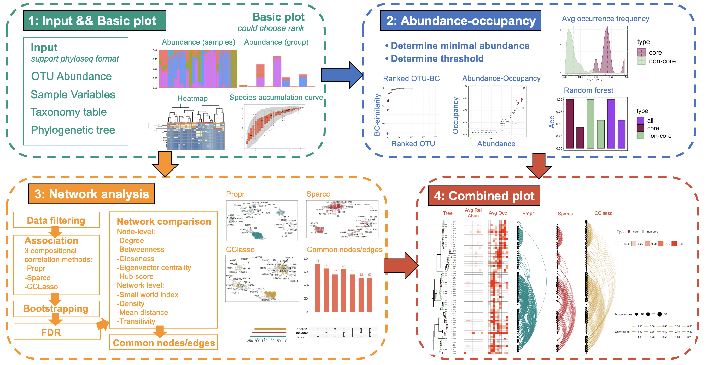

# coreMicrobiome

coreMicrobiome is a web-based R Shiny graphical user interface (GUI) with a R package for scientists without/with programming expertise to conduct explore and visualization of core microbial species which comprises four functional modules: (1) Initial visualization of sampling effort and distribution of dominant bacterial taxa among groups or individual samples at different taxonomic levels; (2) Analysis of Abundance-occupancy distribution and visualizations; (3) Co-occurrence network construction, analysis, comparisons and visualizations; (4) A combined visualization of abundance-occupancy distribution and co-occurrence network for understanding the core species from the common perspective and ecosystem perspective.

To install the package, download (preferrably the latest version of) the package from this site to a local drive and install and load the package in R:
    
    devtools::install_github('lindan1128/coreMicrobiome', force = TRUE)
